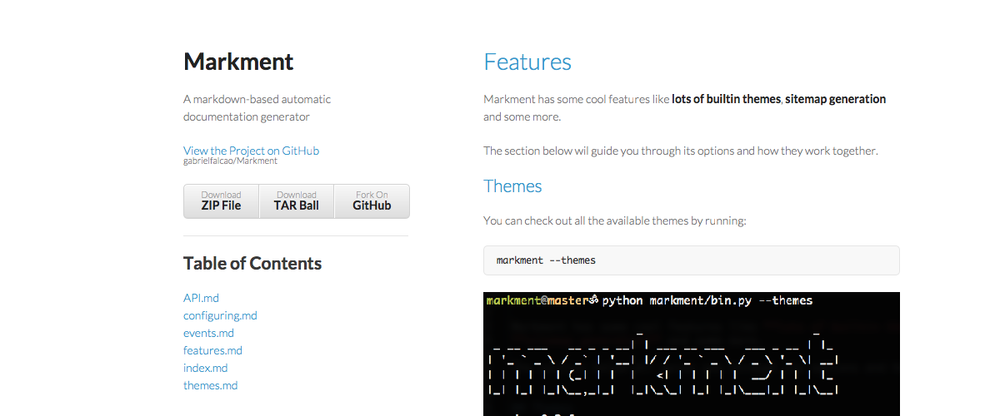

# Developing markment themes


Markment themes are simply a folder containing a metadata file
called `markment.yml` (don't confuse with the `.markment.yml` for [configuration](configuring.md))

This is an example structure of a theme:


```console
theme-folder-name/
  |
  |.. markment.yml
  |.. template.html
  |.. static-files/
        |.. css/
              |.. style.css
        |.. img/
              |.. logo.png
              |.. so on and on...
```

There are some things to consider here:

## The static assets folder

Can be named however you want, but if you don't specify it defaults to `assets`

## The template file

Also can be given any name, defaults to index.html

## The metadata file

Here is where you will specify the names of the files below.

### example `markment.yml`

```yaml
index_template: template.html
assets_path: static-files
```

# Available Themes:

Check out the themes markment has available builtin

# bootstrap-full.png


# bootstrap.png


# flat-ui-full.png


# flat-ui.png


# leap-day.png


# merlot.png


# midnight.png


# minimal.png



# slate.png


# time-machine.png


